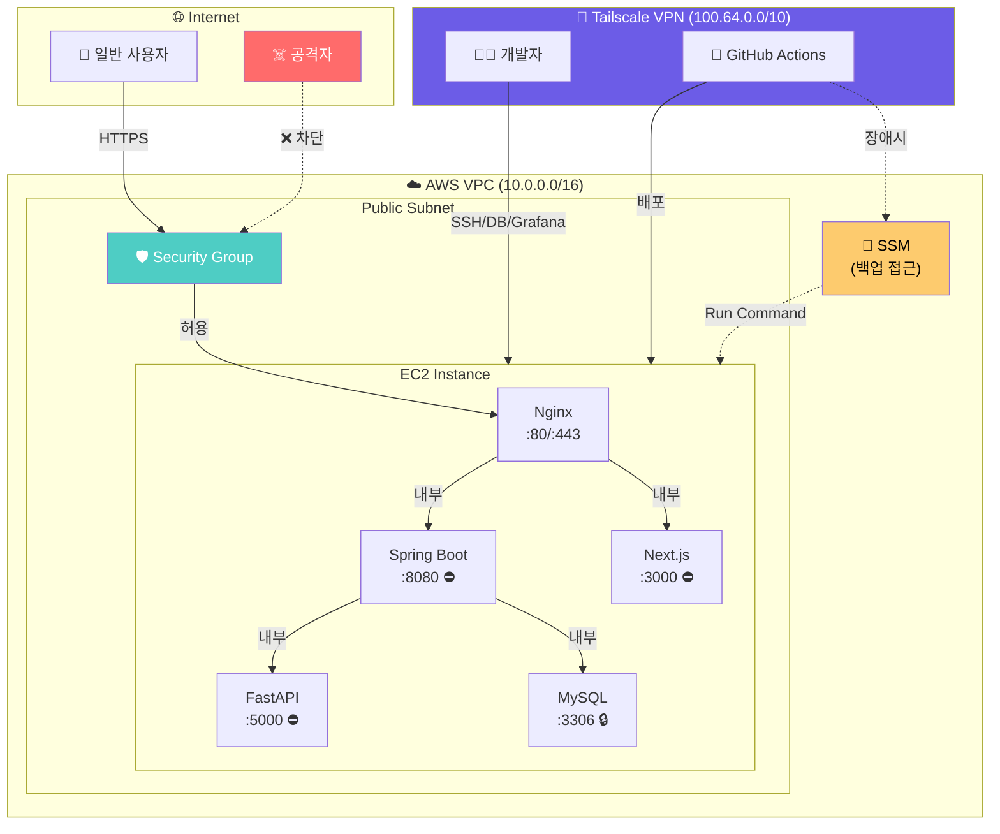
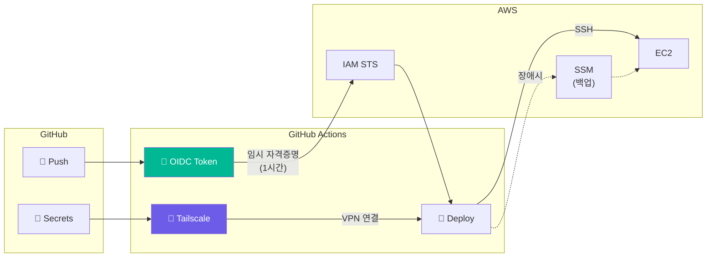

# Billage Infrastructure (Terraform)

빌리지 인프라 코드 (Infrastructure as Code)

## 📁 디렉토리 구조

```
terraform/
├── modules/                    # 재사용 가능한 모듈 (v1, v2 공용)
│   ├── vpc/                    # VPC, Subnet, IGW, Route Table
│   ├── ec2/                    # EC2 인스턴스
│   ├── security-group/         # Security Group
│   ├── vpc-peering/            # VPC Peering
│   ├── cloudwatch/             # CloudWatch 알람
│   └── s3-images/              # S3 이미지 저장소
│
├── v1-bigbang/                 # v1: 단일 인스턴스 아키텍처 (현재 운영)
│   └── envs/
│       ├── dev/
│       └── prod/
│
├── v2/                         # v2: Auto Scaling + ALB (마이그레이션 예정)
│   └── envs/
│       ├── dev/
│       └── prod/
│
├── shared/                     # 공용 인프라 (v1, v2 공통)
│   ├── management/             # VPN + 모니터링
│   ├── s3-images-dev/
│   └── s3-images-prod/
│
├── monitoring/                 # Docker Compose 기반 모니터링
├── scripts/                    # 서버 설정 스크립트
└── docs/                       # 상세 문서
```

## 🚀 시작하기

### 1. 사전 준비

#### AWS CLI 설정
```bash
aws configure
# AWS Access Key ID: <your-access-key>
# AWS Secret Access Key: <your-secret-key>
# Default region name: ap-northeast-2
# Default output format: json
```

#### AWS 키페어 생성 (AWS 콘솔에서)
1. EC2 > Key Pairs > Create key pair
2. 이름: `billage-dev-key`
3. Key pair type: RSA
4. Private key file format: .pem
5. 다운로드된 .pem 파일 안전하게 보관

### 2. 변수 파일 설정

```bash
# v1 환경 (현재 운영)
cd v1-bigbang/envs/dev
cp terraform.tfvars.example terraform.tfvars

# v2 환경 (마이그레이션)
cd v2/envs/dev
```

`terraform.tfvars` 수정:
```hcl
existing_key_name = "billage-keypair"  # 생성한 키페어 이름
```

### 3. Terraform 실행

```bash
# 초기화
terraform init

# 계획 확인
terraform plan

# 인프라 생성
terraform apply
```

### 4. 결과 확인

```bash
# 출력 확인
terraform output

# SSH 접속
ssh -i ~/billage-dev-key.pem ubuntu@<elastic_ip>
```

## 🔧 Backend 설정 (협업용)

팀 협업을 위해 S3 + DynamoDB Backend를 사용합니다.

### S3 버킷 & DynamoDB 테이블 생성

```bash
# S3 버킷 생성
aws s3 mb s3://billage-terraform-state-dev --region ap-northeast-2

# 버전 관리 활성화
aws s3api put-bucket-versioning \
  --bucket billage-terraform-state-dev \
  --versioning-configuration Status=Enabled

# DynamoDB 테이블 생성 (State Locking)
aws dynamodb create-table \
  --table-name billage-terraform-lock-dev \
  --attribute-definitions AttributeName=LockID,AttributeType=S \
  --key-schema AttributeName=LockID,KeyType=HASH \
  --billing-mode PAY_PER_REQUEST \
  --region ap-northeast-2
```

### Backend 활성화

`backend.tf`에서 주석 해제:
```hcl
backend "s3" {
  bucket         = "billage-terraform-state-dev"
  key            = "dev/terraform.tfstate"
  region         = "ap-northeast-2"
  dynamodb_table = "billage-terraform-lock-dev"
  encrypt        = true
}
```

```bash
# Backend 마이그레이션
terraform init -migrate-state
```

## 📊 생성되는 리소스

| 리소스 | 이름 | 설명 |
|--------|------|------|
| VPC | billage-dev-vpc | 10.0.0.0/16 |
| Public Subnet | billage-dev-public-subnet | 10.0.1.0/24 |
| Internet Gateway | billage-dev-igw | - |
| Route Table | billage-dev-public-rt | 0.0.0.0/0 → IGW |
| Security Group | billage-dev-main-sg | SSH, HTTP, HTTPS, MySQL, etc. |
| EC2 | billage-dev-main-server | t4g.medium (ARM) |
| Elastic IP | billage-dev-eip | 고정 IP |

## 💰 예상 비용 (월)

| 리소스 | 비용 |
|--------|------|
| EC2 t4g.medium | ~34,000원 |
| EBS 20GB gp3 | ~2,000원 |
| Elastic IP | 무료 (사용 중일 때) |
| **합계** | **~36,000원** |

## 🔐 Security Architecture

> Zero Trust 원칙 기반의 인프라 보안 설계

### 보안 아키텍처 다이어그램



### 접근 제어 매트릭스

| 접근 경로 | 일반 사용자 | 개발자 (Tailscale) | CI/CD | 공격자 |
|-----------|:-----------:|:------------------:|:-----:|:------:|
| HTTP/HTTPS (:80/443) | ✅ | ✅ | ✅ | ✅ → WAF |
| SSH (:22) | ❌ | ✅ | ✅ | ❌ |
| MySQL (:3306) | ❌ | ✅ | ❌ | ❌ |
| Spring Boot (:8080) | ❌ | ❌ | ❌ | ❌ |
| Grafana (:3001) | ❌ | ✅ | ❌ | ❌ |

### 보안 레이어 (Defense in Depth)

```
┌─────────────────────────────────────────────────────────────────┐
│  Layer 1: Network Access Control                                │
│  ├─ Tailscale VPN → Zero Trust Network Access (ZTNA)           │
│  ├─ Security Group → Instance-level firewall                    │
│  └─ NACL → Subnet-level firewall (Phase 2)                     │
├─────────────────────────────────────────────────────────────────┤
│  Layer 2: Identity & Access Management                          │
│  ├─ OIDC → Keyless CI/CD authentication                        │
│  ├─ IAM Roles → Least privilege principle                       │
│  └─ SSM Session Manager → Audited server access                │
├─────────────────────────────────────────────────────────────────┤
│  Layer 3: Secrets Management                                    │
│  ├─ GitHub Secrets → CI/CD credentials (Tailscale OAuth 등)    │
│  └─ SSM Parameter Store (SecureString) → All app secrets       │
│      ├─ /billage/{env}/db/password (암호화)                    │
│      ├─ /billage/{env}/jwt/secret (암호화)                     │
│      └─ /billage/{env}/api-keys/* (암호화)                     │
├─────────────────────────────────────────────────────────────────┤
│  Layer 4: Application Security                                  │
│  ├─ Nginx Reverse Proxy → Hide backend ports                   │
│  ├─ Rate Limiting → DDoS mitigation                            │
│  └─ WAF → OWASP Top 10 protection (Phase 2)                    │
└─────────────────────────────────────────────────────────────────┘
```

### CI/CD 보안 파이프라인



### 보안 개선 효과 (Before → After)

| 항목 | Before | After | 개선 효과 |
|------|--------|-------|-----------|
| SSH 접근 | `0.0.0.0/0` | Tailscale Only | 공격 표면 99% ↓ |
| DB 접근 | `0.0.0.0/0` | Tailscale Only | SQL Injection 직접 공격 차단 |
| AWS 인증 | Access Key (영구) | OIDC Token (1시간) | 자격증명 유출 위험 제거 |
| 백엔드 포트 | 외부 노출 | localhost only | Actuator/Swagger 노출 방지 |
| 장애 대응 | 단일 경로 | SSM 백업 경로 | SPOF 제거 |

### 실제 탐지된 공격 (운영 로그 기반)

```log
# Git 저장소 탈취 시도
216.81.245.109 - "GET /.git/config HTTP/1.1" 404 ← 차단됨

# ThinkPHP RCE 공격 (CVE-2018-20062)
98.88.247.68 - "GET /?s=/Index/\think\app/invokefunction..." 200 ← 대상 아님

# Spring Boot Actuator 스캔
98.88.247.68 - "GET /actuator/env HTTP/1.1" 404 ← Nginx에서 차단
```

> 📖 상세 분석: [Security Analysis](context/docs/SECURITY_ANALYSIS.md) | [Decision Log](context/docs/SECURITY_DECISION_LOG.md)

### 보안 권장사항

1. **SSH 접근 제한**: `ssh_allowed_cidr`를 Tailscale CIDR (`100.64.0.0/10`)로 제한
2. **DB 접근 제한**: Tailscale 네트워크에서만 접근 허용
3. **키페어 관리**: .pem 파일은 절대 Git에 커밋하지 않음
4. **tfvars 관리**: `terraform.tfvars`는 .gitignore에 포함
5. **OIDC 사용**: CI/CD에서 장기 Access Key 대신 OIDC 사용

## 🔄 협업 워크플로우 (GitHub Flow)

```
1. feature 브랜치 생성: feature/add-rds
2. 코드 작성 및 terraform plan 확인
3. PR 생성 → 코드 리뷰
4. main 머지 → terraform apply (수동 또는 CI/CD)
```

## 🗑️ 인프라 삭제

```bash
terraform destroy
```

## 📚 참고

- [Terraform AWS Provider](https://registry.terraform.io/providers/hashicorp/aws/latest)
- [AWS 서울 리전 가격](https://aws.amazon.com/ko/ec2/pricing/on-demand/)
- [Terraform Best Practices](https://www.terraform-best-practices.com/)
